# Korisnički priručnik (User Manual)

# Helpdesk i Ticketing Sistem

## URL za pristup sistemu

Primarni URL:

http://46.224.179.251/

Rezervni URL:

https://telecomsupport.hodzicmirza.com/

---

# 1. Uvod

Ovaj korisnički priručnik namijenjen je krajnjim korisnicima Helpdesk i Ticketing sistema. Dokument opisuje način korištenja sistema, korisničke uloge, dostupne funkcionalnosti, korake za izvršavanje najvažnijih aktivnosti te očekivane rezultate nakon svake akcije.

Sistem omogućava prijavu problema, komunikaciju sa korisničkom podrškom, upravljanje tiketima, administraciju korisnika i timova, pregled paketa i pretplata, generisanje izvještaja te korištenje AI funkcionalnosti za podršku radu zaposlenika.

---

# 2. Kome je sistem namijenjen

Sistem je namijenjen:

- Klijentima telekom usluga
- Agentima korisničke podrške
- Tehničarima
- Administratorima sistema

Svaka korisnička uloga ima različita ovlaštenja i pristup određenim funkcionalnostima.

---

# 3. Korisničke uloge

## Klijent

Može:

- Kreirati tiket
- Pregledati vlastite tikete
- Komunicirati sa podrškom
- Pregledati pakete i pretplate
- Koristiti FAQ
- Ocijeniti zatvoreni tiket

Ne može:

- Vidjeti tuđe tikete
- Upravljati korisnicima
- Upravljati timovima
- Pristupati administrativnim funkcijama

## Agent

Može:

- Pregledati tikete
- Komunicirati sa korisnicima
- Koristiti AI prijedlog odgovora
- Dodjeljivati prioritete
- Prosljeđivati tikete
- Pregledati korisničke profile

## Tehničar

Može:

- Pregledati dodijeljene tikete
- Mijenjati status tiketa
- Koristiti AI prijedlog odgovora
- Dodavati interne komentare

## Administrator

Može:

- Upravljati korisnicima
- Upravljati timovima
- Upravljati paketima
- Upravljati pretplatama
- Upravljati FAQ sadržajem
- Pregledati audit logove
- Koristiti AI Insights
- Koristiti MCP Admin Copilot
- Generisati izvještaje

---

# 4. Testni korisnici

## Administrator

Email: admin@test.com

Lozinka: Admin123!

## Klijent

Email: client@test.com

Lozinka: Client123!

## Agent

Email: amina.hodzic@telecom.ba

Lozinka: Agent123!

## Tehničar

Email: mirza.omerovic@telecom.ba

Lozinka: Tech123!

---

# 5. Prijava u sistem

## Korak 1

Otvoriti URL sistema.

## Korak 2

Unijeti email adresu i lozinku.

## Korak 3

Kliknuti na dugme "Prijava".

### Očekivani rezultat

Sistem prikazuje dashboard odgovarajuće korisničke uloge.

Mjesto za sliku:

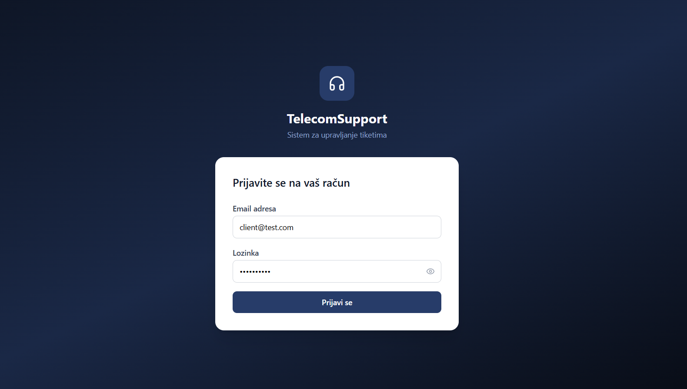
---

# 6. Dashboard

Dashboard predstavlja početni ekran nakon prijave.

Prikazuje:

- Statistiku
- Najnovije aktivnosti
- Brze akcije
- Pregled tiketa

### Očekivani rezultat

Korisnik dobija pregled najvažnijih informacija odmah nakon prijave.

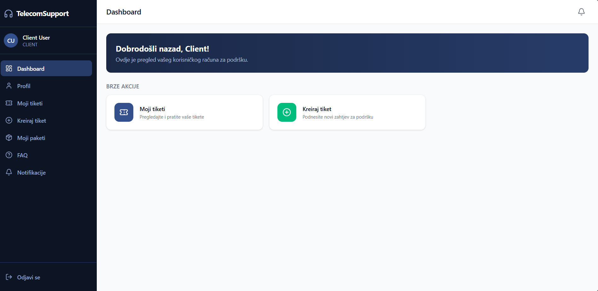

---

# 7. Kreiranje novog tiketa

## Korak 1

Otvoriti:

Moji tiketi → Novi tiket

## Korak 2

Popuniti:

- Naslov
- Kategoriju
- Prioritet
- Opis problema

## Korak 3

Kliknuti na "Pošalji".

### Očekivani rezultat

Sistem kreira tiket i dodjeljuje mu jedinstveni identifikator.

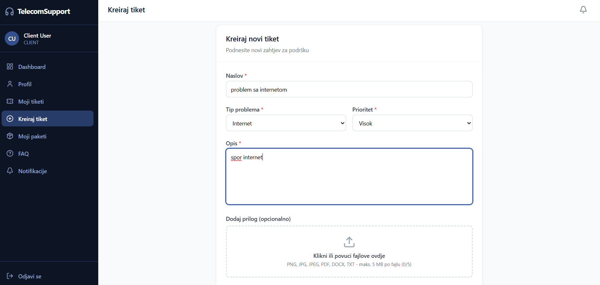
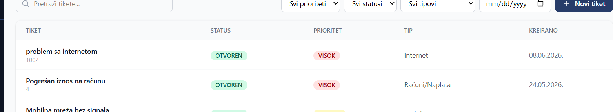

---

# 8. Pregled tiketa

Otvoriti sekciju:

Moji tiketi

Prikazuju se:

- ID tiketa
- Naslov
- Status
- Prioritet
- Datum kreiranja

### Očekivani rezultat

Korisnik vidi listu svih svojih tiketa.

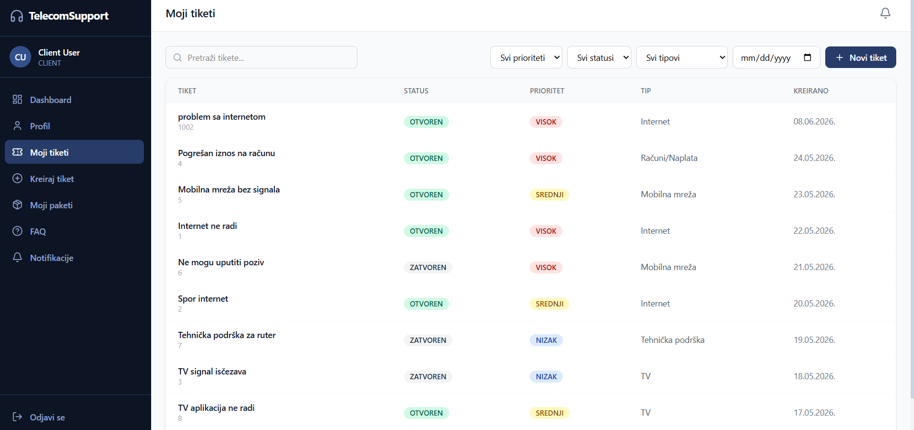

---

# 9. Detalji tiketa

Klikom na tiket otvaraju se detalji.

Prikazuju se:

- Opis problema
- Historija komunikacije
- Status
- Prioritet
- Dodijeljeni korisnik
- Prilozi

### Očekivani rezultat

Korisnik dobija kompletan pregled stanja tiketa.

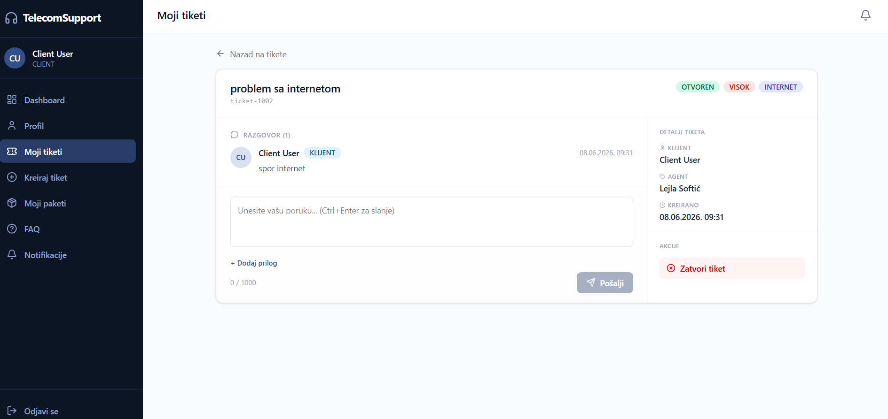

---

# 10. Komunikacija kroz tiket

## Korak 1

Otvoriti tiket.

## Korak 2

Unijeti poruku.

## Korak 3

Kliknuti na "Pošalji".

### Očekivani rezultat

Poruka se evidentira u historiji komunikacije.

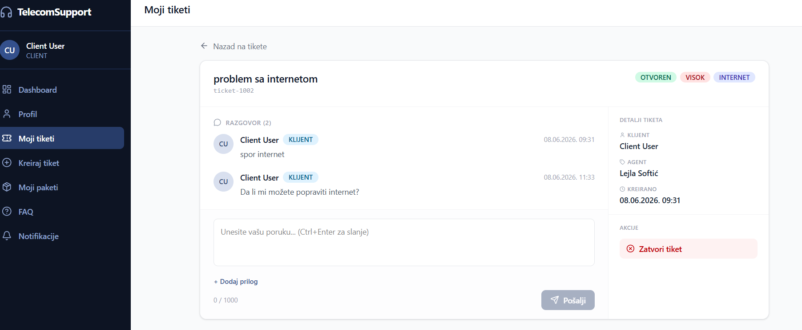

---

# 11. Ocjenjivanje tiketa

Nakon zatvaranja tiketa korisnik može dati ocjenu.

Koraci:

1. Otvoriti zatvoreni tiket
2. Kliknuti "Ocijeni"
3. Odabrati ocjenu 1–5
4. Dodati komentar (opcionalno)

### Očekivani rezultat

Ocjena se sprema u sistem.

---

# 12. Profil korisnika

Na profilu korisnik može:

- Pregledati lične podatke
- Promijeniti email
- Promijeniti lozinku

Agenti i tehničari dodatno vide statistiku rada.

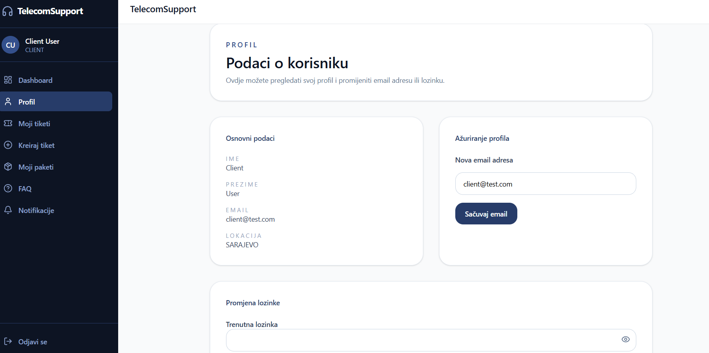
---

# 13. Paketi i pretplate

Klijent može pregledati:

- Aktivne pakete
- Historiju pretplata
- Datum aktivacije

### Očekivani rezultat

Prikaz svih aktivnih usluga korisnika.

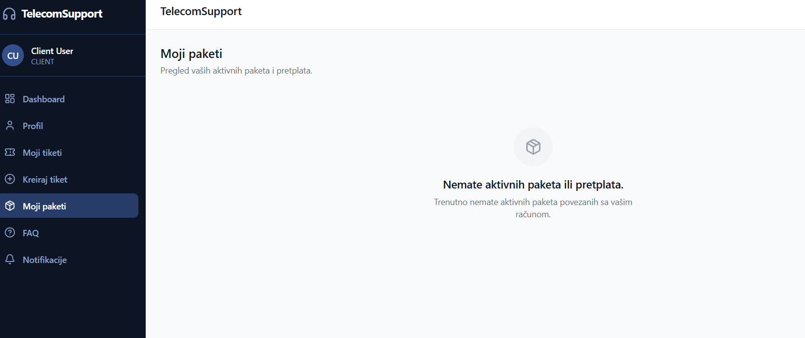

---

# 14. FAQ

FAQ sadrži odgovore na najčešća pitanja.

Korisnik može:

- Pregledavati pitanja
- Pretraživati FAQ

### Očekivani rezultat

Brže pronalaženje odgovora bez kreiranja tiketa.

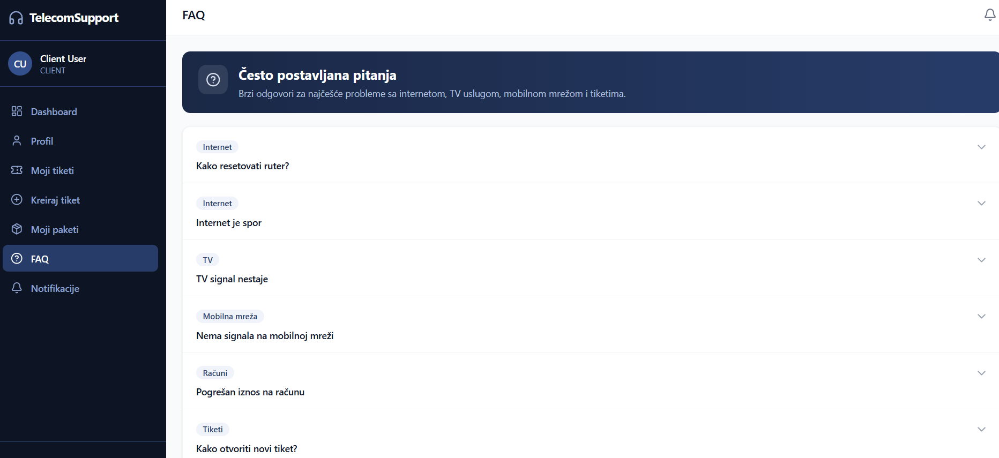

---

# 15. AI prijedlog odgovora

Dostupno agentima i tehničarima.

Koraci:

1. Otvoriti tiket
2. Kliknuti "AI prijedlog odgovora"
3. Sačekati generisanje prijedloga

### Očekivani rezultat

Sistem generiše prijedlog odgovora koji korisnik može izmijeniti prije slanja.

[SLIKA 10 – AI prijedlog odgovora]

---

# 16. AI Insights

Dostupno administratorima.

Prikazuje:

- Trendove
- Statistike
- Preporuke

### Očekivani rezultat

Administrator dobija pregled stanja sistema.

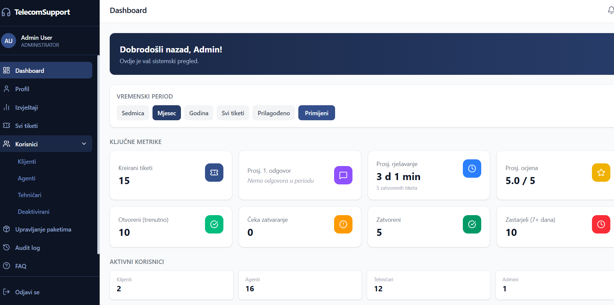

---

# 17. MCP Admin Copilot

Dostupno administratorima.

Omogućava postavljanje pitanja o sistemu putem chat interfejsa.

### Primjeri pitanja

- Koji tim ima najveće opterećenje?
- Koliko je otvorenih tiketa?
- Koji korisnici imaju najviše zahtjeva?

### Očekivani rezultat

Sistem generiše odgovor na osnovu podataka iz baze.

[SLIKA 12 – MCP Admin Copilot]

---

# 18. Administracija korisnika

Administrator može:

- Kreirati korisnika
- Urediti korisnika
- Aktivirati korisnika
- Deaktivirati korisnika

### Očekivani rezultat

Promjene se spremaju i odmah postaju vidljive u sistemu.

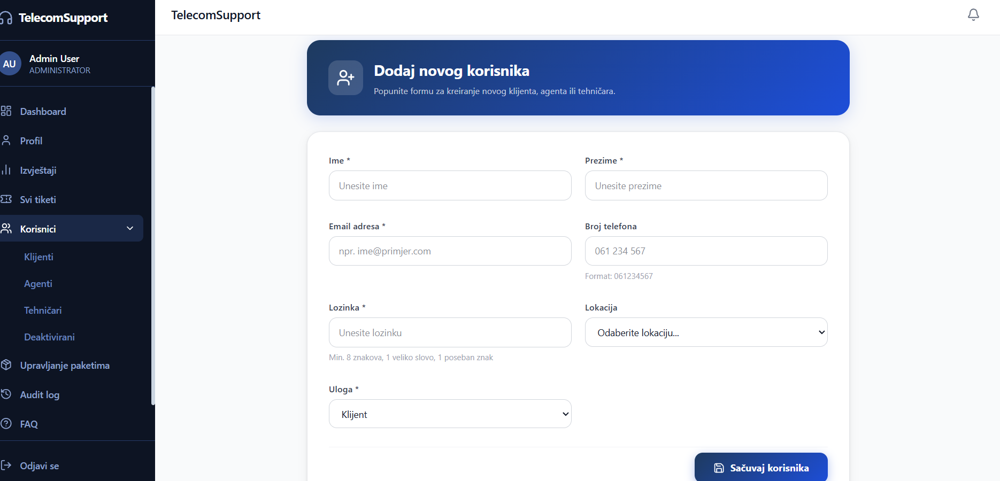

---

# 19. Administracija timova

Administrator može:

- Kreirati tim
- Dodavati članove
- Mijenjati članove tima

### Očekivani rezultat

Timovi postaju dostupni za dodjelu tiketa.

[SLIKA 14 – Upravljanje timovima]

---

# 20. Izvještaji

Administrator može generisati izvještaje.

Podržani izvještaji:

- Broj tiketa
- Status tiketa
- Opterećenje timova
- Ocjene korisnika

### Export

Klikom na Export moguće je preuzeti CSV datoteku.

### Očekivani rezultat

Generisan izvještaj i preuzeta CSV datoteka.

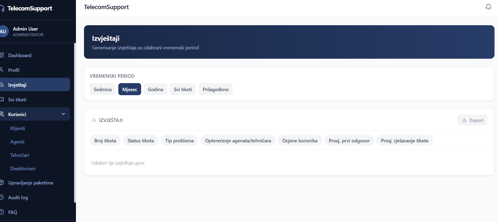

---

# 21. Ograničenja sistema

Klijent ne može:

- Pregledati tuđe tikete
- Upravljati korisnicima
- Mijenjati statuse tiketa

Agent ne može:

- Upravljati korisnicima
- Upravljati timovima

Tehničar ne može:

- Pristupati administrativnim funkcijama

Sistem ne dozvoljava pristup funkcijama za koje korisnik nema odgovarajuća ovlaštenja.

---

# 22. Preporuke za korištenje

- Koristiti FAQ prije kreiranja tiketa.
- Prilikom prijave problema dati što detaljniji opis.
- Redovno pratiti status otvorenih tiketa.
- Ne dijeliti pristupne podatke drugim korisnicima.
- Koristiti AI prijedloge kao pomoć, a ne kao konačan odgovor bez provjere.

---

# 23. Zaključak

Helpdesk i Ticketing Sistem predstavlja centralizovano rješenje za upravljanje korisničkom podrškom. Sistem omogućava efikasno upravljanje tiketima, korisnicima, timovima, paketima i izvještajima, uz dodatnu podršku AI funkcionalnosti koje unapređuju svakodnevni rad korisnika i administratora.
