# Korisnički priručnik (User Manual)

# Helpdesk i Ticketing Sistem

## URL za pristup sistemu

Primarni URL:

http://46.224.179.251/

Rezervni URL:

https://telecomsupport.hodzicmirza.com/

---

# 1. Uvod

Ovaj korisnički priručnik namijenjen je krajnjim korisnicima Helpdesk i Ticketing sistema. Dokument opisuje način korištenja sistema, korisničke uloge, dostupne funkcionalnosti, korake za izvršavanje najvažnijih aktivnosti te očekivane rezultate nakon svake akcije.

Sistem omogućava prijavu problema, komunikaciju sa korisničkom podrškom, upravljanje tiketima, administraciju korisnika i timova, pregled paketa i pretplata, generisanje izvještaja te korištenje AI funkcionalnosti za podršku radu zaposlenika.

---

# 2. Kome je sistem namijenjen

Sistem je namijenjen:

- Klijentima telekom usluga
- Agentima korisničke podrške
- Tehničarima
- Administratorima sistema

Svaka korisnička uloga ima različita ovlaštenja i pristup određenim funkcionalnostima.

---

# 3. Korisničke uloge

## Klijent

Može:

- Kreirati tiket (sa ili bez privitaka)
- Pregledati vlastite tikete (otvorene i zatvorene)
- Komunicirati sa podrškom putem poruka unutar tiketa
- Dodavati privitke na tiket
- Zatražiti zatvaranje tiketa
- Prihvatiti ili odbiti prijedlog zatvaranja tiketa
- Pregledati detalje svakog vlastitog tiketa (opis, status, prioritet, historija komunikacije)
- Pregledati aktivne pakete i historiju pretplata
- Koristiti FAQ (pregledati i pretraživati odgovore)
- Ocijeniti zatvoreni tiket (ocjena 1–5 sa opcionim komentarom)
- Pregledati i urediti vlastiti profil (email, lozinka)
- Primati i čitati notifikacije o promjenama na tiketima
- Prijaviti se emailom ili brojem telefona u međunarodnom formatu

Ne može:

- Vidjeti tuđe tikete
- Mijenjati status tiketa
- Upravljati korisnicima, timovima ili paketima
- Pristupati administrativnim funkcijama
- Koristiti AI funkcionalnosti
- Pregledati audit logove ili izvještaje

## Agent

Može:

- Pregledati sve tikete u sistemu
- Pregledati vlastite dodijeljene tikete (otvorene i zatvorene odvojeno)
- Dodijeliti tiket sebi (self-assign)
- Komunicirati sa korisnicima putem poruka unutar tiketa
- Dodavati interne komentare (vidljivi samo osoblju, ne klijentu)
- Dodavati privitke na komentare
- Koristiti AI prijedlog odgovora za generisanje nacrta poruke
- Postavljati i mijenjati interni prioritet tiketa
- Prosljeđivati tiket drugom agentu (sa odabirom konkretnog agenta)
- Prosljeđivati tiket tehničaru
- Pokrenuti automatsko prosljeđivanje tiketa
- Pregledati listu dostupnih agenata i njihove skorove za prosljeđivanje
- Zatvoriti tiket
- Forsirati zatvaranje tiketa (force-close)
- Pregledati korisničke profile i statistike korisnika
- Pregledati vlastite radne statistike
- Upravljati vlastitom dostupnošću (availability)
- Pregledati timove kojima pripada
- Pregledati i urediti vlastiti profil (email, lozinka)
- Primati i čitati notifikacije

Ne može:

- Upravljati korisnicima (kreiranje, deaktivacija)
- Upravljati timovima
- Pregledati audit logove
- Generisati izvještaje
- Koristiti AI Insights ili MCP Admin Copilot
- Upravljati paketima ili pretplatama

## Tehničar

Može:

- Pregledati dodijeljene tikete (otvorene i zatvorene)
- Mijenjati status tiketa
- Komunicirati kroz tiket (slanje poruka korisniku)
- Dodavati interne komentare (vidljivi samo osoblju, ne klijentu)
- Dodavati privitke na komentare
- Koristiti AI prijedlog odgovora za generisanje nacrta poruke
- Pregledati profil korisnika koji je kreirao tiket
- Pregledati vlastite radne statistike
- Upravljati vlastitom dostupnošću (availability)
- Pregledati i urediti vlastiti profil (email, lozinka)
- Primati i čitati notifikacije

Ne može:

- Pregledati tikete koji mu nisu dodijeljeni
- Prosljeđivati tikete ili forsirati zatvaranje
- Upravljati korisnicima, timovima ili paketima
- Pregledati audit logove ili generisati izvještaje
- Koristiti AI Insights ili MCP Admin Copilot

## Administrator

Može:

- Upravljati korisnicima (kreirati, uređivati, aktivirati, deaktivirati; ne može deaktivirati vlastiti nalog)
- Upravljati timovima (kreirati timove, dodavati i mijenjati članove, preraspoređivati timove)
- Upravljati paketima iz kataloga (kreirati, uređivati, brisati, mijenjati status aktivnosti)
- Upravljati pretplatama klijenata (pregledati, kreirati, deaktivirati)
- Upravljati FAQ sadržajem (kreirati, uređivati, brisati unose)
- Pregledati sve tikete u sistemu
- Forsirati zatvaranje tiketa
- Pregledati audit logove sa filtriranjem po tipu akcije i korisniku
- Koristiti AI Insights (trendovi, statistike sistema, preporuke)
- Koristiti MCP Admin Copilot (chat interfejs za postavljanje pitanja nad podacima sistema)
- Pregledati dashboard sa statistikama sistema i brojem SLA kršenja
- Generisati izvještaje (broj tiketa, status tiketa, opterećenje timova, ocjene) i eksportirati CSV
- Pregledati i uređivati korisničke profile i statistike
- Pregledati i urediti vlastiti profil (email, lozinka)
- Primati i čitati notifikacije

---

# 4. Testni korisnici

## Administrator

Email: admin@test.com

Lozinka: Admin123!

## Klijent

Email: client@test.com

Lozinka: Client123!

## Agent

Email: amina.hodzic@telecom.ba

Lozinka: Agent123!

## Tehničar

Email: mirza.omerovic@telecom.ba

Lozinka: Tech123!

---

# 5. Prijava u sistem

## Korak 1

Otvoriti URL sistema.

## Korak 2

Unijeti email adresu ili broj telefona u međunarodnom formatu (+387...) i lozinku.

## Korak 3

Kliknuti na dugme "Prijava".

### Očekivani rezultat

Sistem prikazuje dashboard odgovarajuće korisničke uloge.

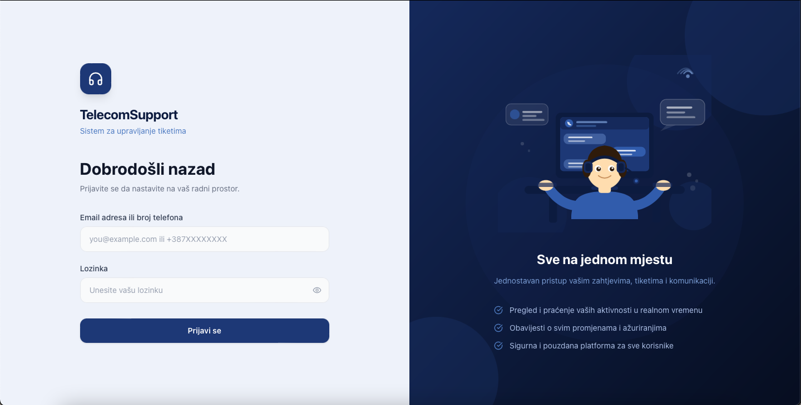
---

# 6. Dashboard

Dashboard predstavlja početni ekran nakon prijave.

Prikazuje:

- Statistiku (uz odgovarajuću autorizaciju)
- Najnovije aktivnosti
- Brze akcije
- Pregled tiketa

### Očekivani rezultat

Korisnik dobija pregled najvažnijih informacija odmah nakon prijave.

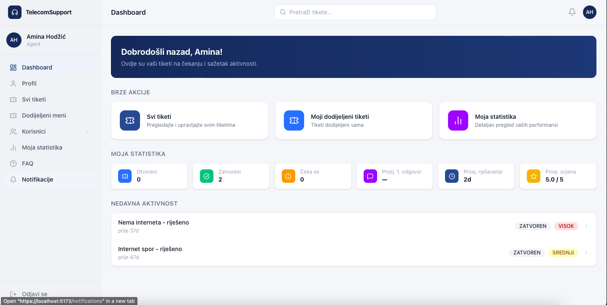
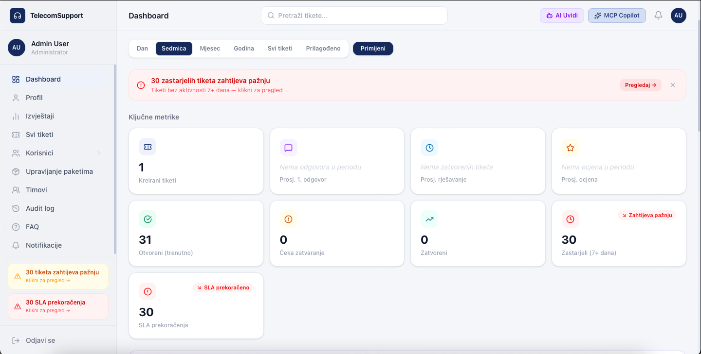

---

# 7. Kreiranje novog tiketa

## Korak 1

Kao klijent, otvoriti:

Moji tiketi → Novi tiket

## Korak 2

Popuniti:

- Naslov
- Kategoriju
- Prioritet
- Opis problema

## Korak 3

Kliknuti na "Pošalji".

### Očekivani rezultat

Sistem kreira tiket i dodjeljuje mu jedinstveni identifikator.

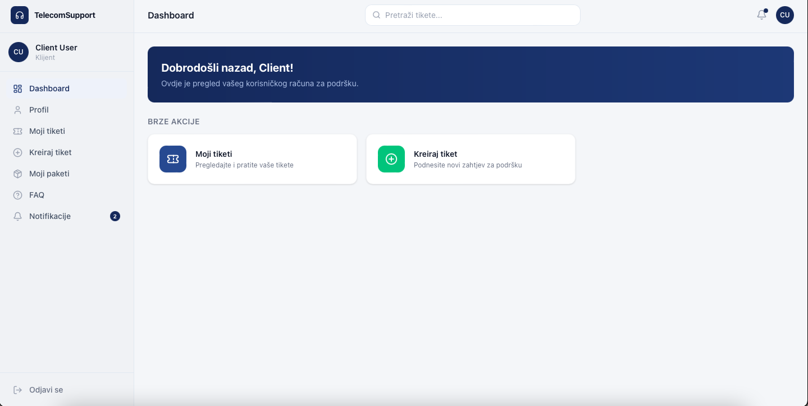
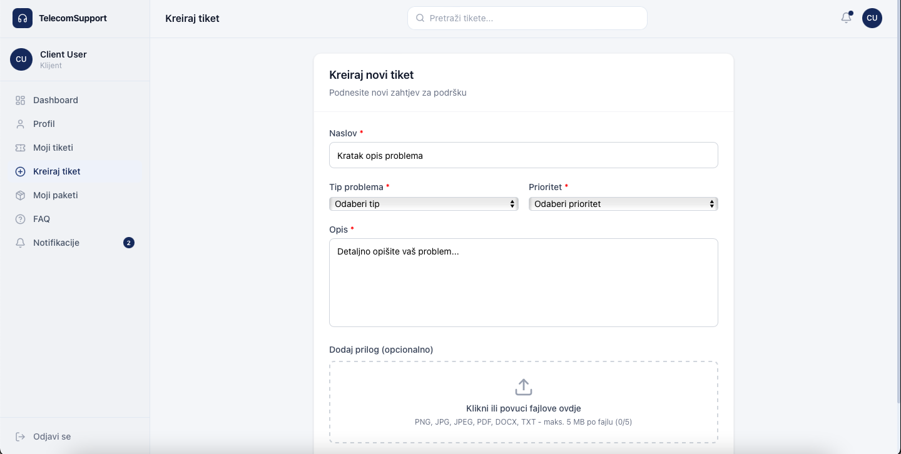

---

# 8. Pregled tiketa

Otvoriti sekciju:

Moji tiketi

Prikazuju se:

- ID tiketa
- Naslov
- Status
- Prioritet
- Datum kreiranja

### Očekivani rezultat

Korisnik vidi listu svih svojih tiketa.

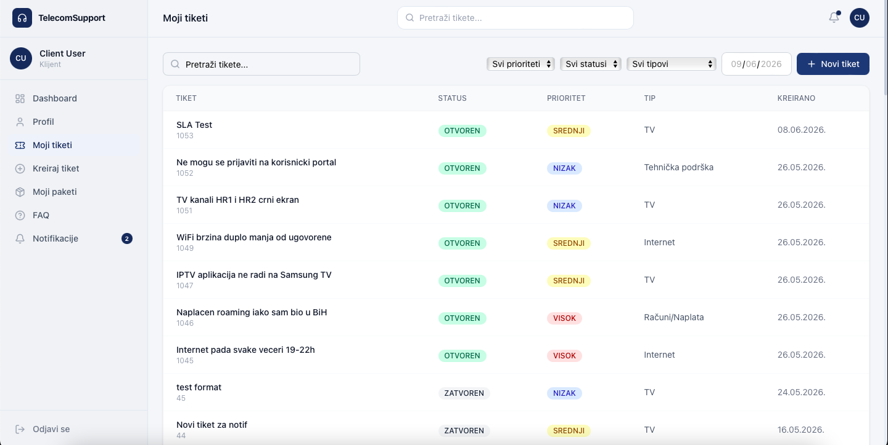

---

# 9. Detalji tiketa

Klikom na tiket otvaraju se detalji.

Prikazuju se:

- Opis problema
- Historija komunikacije
- Status
- Prioritet
- Dodijeljeni korisnik
- Prilozi

### Očekivani rezultat

Korisnik dobija kompletan pregled stanja tiketa.

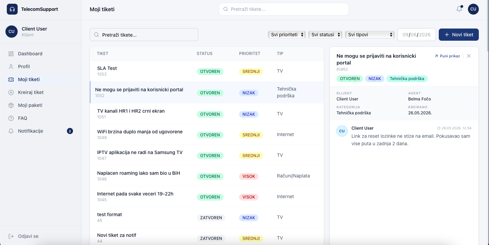

Klikom na puni prikaz otvaramo detalje tiketa:

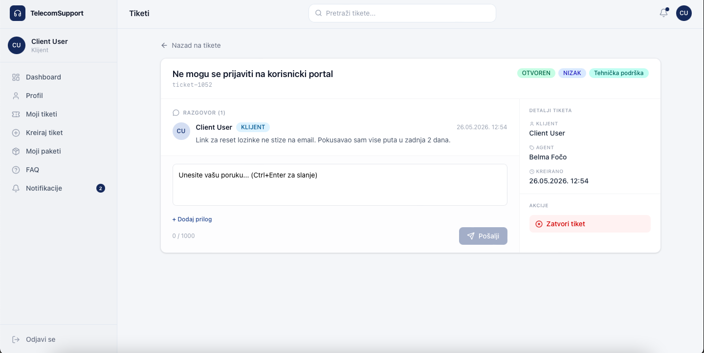

---

# 10. Komunikacija kroz tiket

## Korak 1

Otvoriti tiket (puni prikaz).

## Korak 2

Unijeti poruku.

## Korak 3

Kliknuti na "Pošalji".

### Očekivani rezultat

Poruka se evidentira u historiji komunikacije.

---

# 11. Ocjenjivanje tiketa

Nakon zatvaranja tiketa korisnik može dati ocjenu.

Koraci:

1. Otvoriti zatvoreni tiket
2. Kliknuti "Ocijeni"
3. Odabrati ocjenu 1–5
4. Dodati komentar (opcionalno)

### Očekivani rezultat

Ocjena se sprema u sistem.
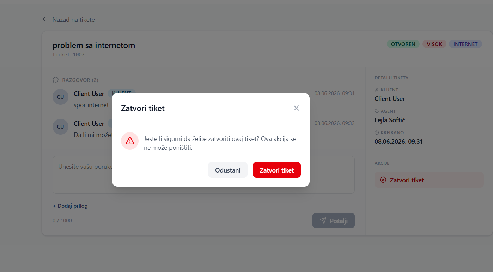

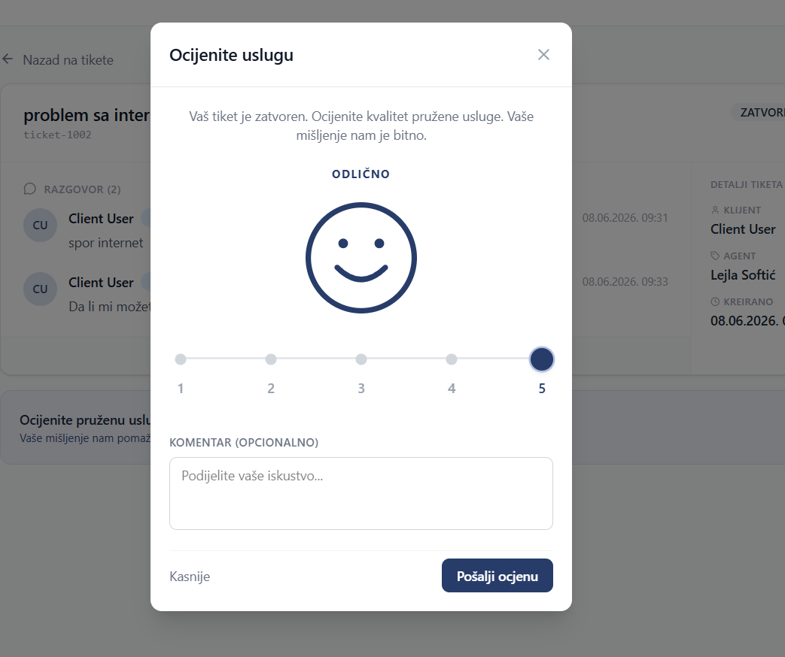

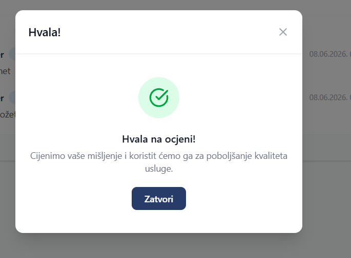

---

# 12. Profil korisnika

Na profilu korisnik može:

- Pregledati lične podatke
- Promijeniti email
- Promijeniti lozinku

Agenti i tehničari dodatno vide radnu statistiku: broj obrađenih tiketa, prosječno vrijeme prvog odgovora i prosječno vrijeme rješavanja.

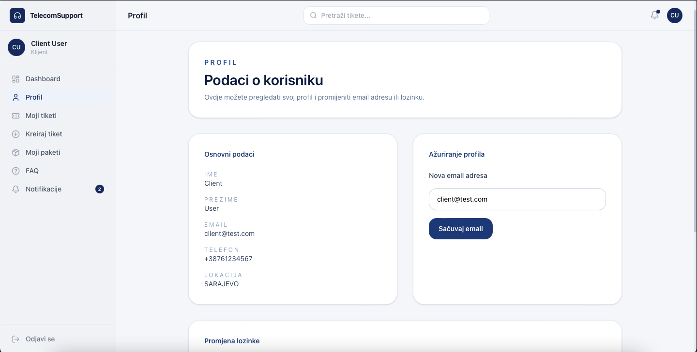

---

# 13. Notifikacije

Sve korisničke uloge primaju notifikacije o relevantnim događajima u sistemu.

Notifikacije se prikazuju klikom na ikonu zvona u gornjem desnom uglu navigacijske trake ili u sidebar-u. Broj nepročitanih notifikacija prikazan je kao badge na ikoni.

Događaji koji generišu notifikacije:

- Promjena statusa tiketa
- Nova poruka na tiketu
- Dodjela tiketa
- Zahtjev za zatvaranjem tiketa
- Prihvatanje ili odbijanje zatvaranja tiketa

## Označavanje kao pročitano

Kliknuti na pojedinačnu notifikaciju da je označite kao pročitanu, ili koristiti opciju "Označi sve kao pročitano" za masovno označavanje.

### Očekivani rezultat

Broj na badgeu se smanjuje, pročitane notifikacije mijenjaju izgled.

[Pregled notifikacija](images/notifs.png)

---

# 14. Paketi i pretplate

Klijent može pregledati:

- Aktivne pakete
- Historiju pretplata
- Datum aktivacije

### Očekivani rezultat

Prikaz svih aktivnih usluga korisnika.

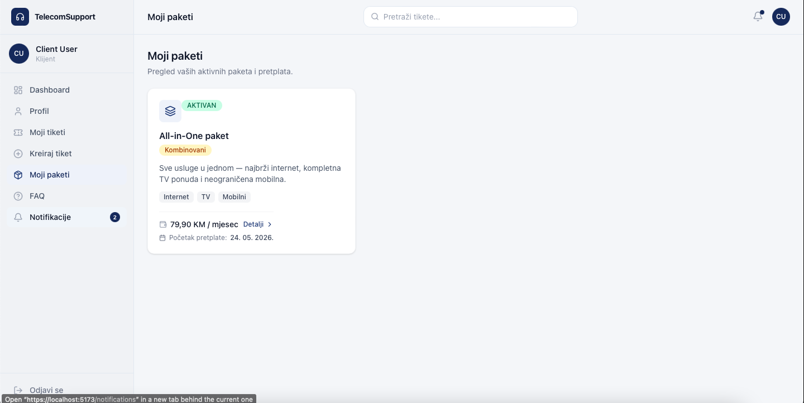

---

# 15. FAQ

FAQ sadrži odgovore na najčešća pitanja.

Korisnik može:

- Pregledavati pitanja
- Pretraživati FAQ

### Očekivani rezultat

Brže pronalaženje odgovora bez kreiranja tiketa.

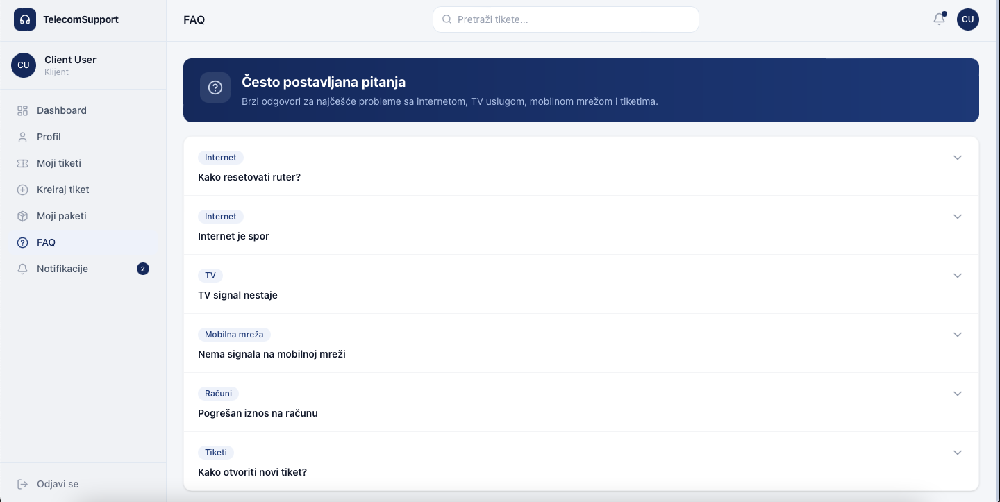

---

# 16. Administracija FAQ-a

Dostupno administratorima.

Administrator može kreirati, uređivati i brisati FAQ unose.

## Kreiranje novog FAQ unosa

## Korak 1

Otvoriti sekciju FAQ u admin panelu.

## Korak 2

Kliknuti na "Novi unos".

## Korak 3

Unijeti pitanje i odgovor.

## Korak 4

Kliknuti "Sačuvaj".

### Očekivani rezultat

Novi FAQ unos postaje vidljiv svim korisnicima sistema.

## Uređivanje i brisanje

Klikom na postojeći unos moguće ga je urediti ili obrisati. Brisanje je trajno.

---

# 17. AI prijedlog odgovora

Dostupno agentima i tehničarima.

Koraci:

1. Otvoriti tiket
2. Kliknuti "AI prijedlog"
3. Sačekati generisanje prijedloga
4. Prihvatiti, generisati novi prijedlog ili odbaciti
5. Nakon prihvatanja prijedloga isti se upiše u text box chat-a i može se poslati

### Očekivani rezultat

Sistem generiše prijedlog odgovora koji korisnik može izmijeniti prije slanja.

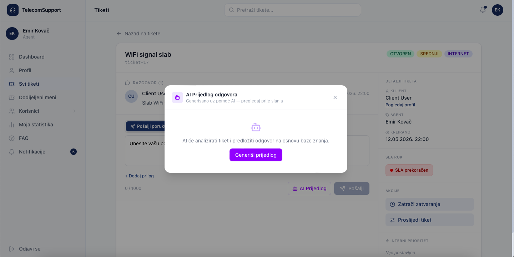
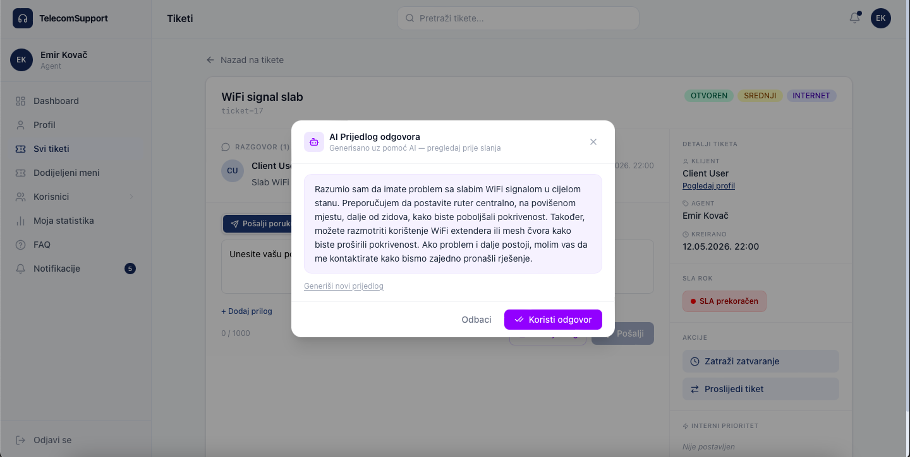

---

# 18. AI Uvidi

Dostupno administratorima.

AI Uvidi panel analizira trenutne metrike admin dashboarda (broj tiketa, vremena odgovora, ocjene, opterećenje agenata) koristeći Gemini AI i vraća strukturisane uvide.

## Korak 1

Otvoriti Admin Dashboard.

## Korak 2

Kliknuti na dugme AI Uvidi u gornjem desnom dijelu dashboarda. Otvara se bočni panel.

## Korak 3

Kliknuti na "Generiši". Sistem šalje trenutne metrike dashboarda AI servisu.

## Korak 4

Sačekati dok AI analizira metrike.

### Očekivani rezultat

Panel prikazuje tri sekcije:

- **Narativni sažetak** — tekstualni opis trenutnog stanja sistema
- **Anomalije** — detektovane nepravilnosti sa naslovom i opisom (npr. neobično visok broj nezatvorenih tiketa)
- **Preporuke** — prijedlozi akcija sa naslovom i opisom; preporuke vezane za određenu kategoriju tiketa sadrže link koji direktno filtrira tikete te kategorije na dashboardu

Kliknuti "Osvježi" za ponovnu analizu sa najnovijim metrikama.

**Napomena:** Uvidi se generišu na osnovu metrika trenutno prikazanog perioda na dashboardu. Promjenom perioda na dashboardu i ponovnim klikom na "Osvježi" dobijaju se uvidi za novi period.

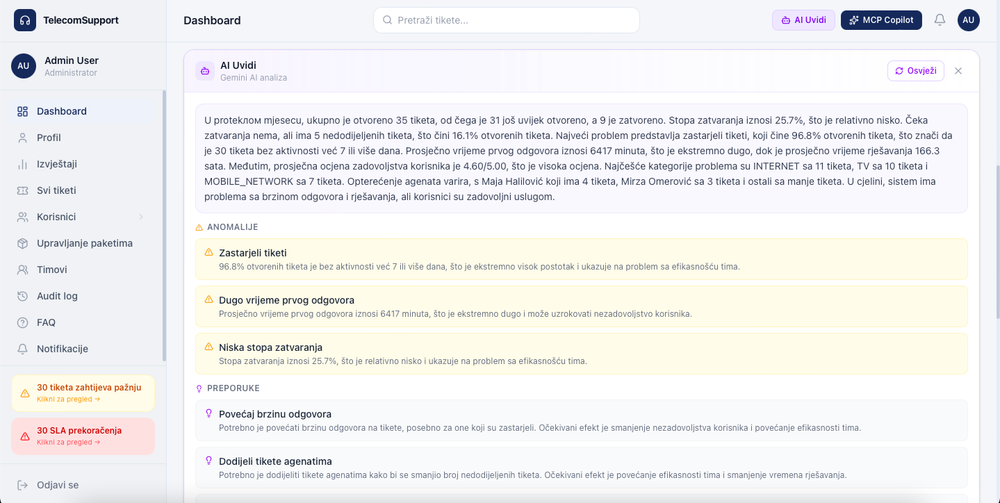

---

# 19. MCP Admin Copilot

Dostupno administratorima.

MCP Admin Copilot je chat interfejs koji administratoru omogućava postavljanje slobodnih pitanja o živim podacima sistema. Odgovori se generišu u realnom vremenu putem MCP servera koji direktno upituje bazu podataka.

## Korak 1

Kliknuti na dugme **MCP Copilot** u gornjem desnom uglu navigacijske trake. Otvara se chat panel.

## Korak 2

Odabrati jedan od prijedloga pitanja koji se prikazuju u praznom panelu ili upisati vlastito pitanje u polje za unos na dnu panela.

### Prijedlozi pitanja

- Koji tim je najopterećeniji?
- Prikaži tikete bez odgovora duže od 2 sata
- Koji problemi se ponavljaju, a nisu pokriveni FAQ-om?

## Korak 3

Kliknuti na dugme za slanje (ili pritisnuti Enter).

### Očekivani rezultat

Sistem šalje pitanje MCP serveru koji analizira žive podatke i vraća odgovor u chat. Razgovor se čuva tokom sesije — moguće je postavljati više pitanja u nizu unutar istog panela.

**Napomena:** Ako MCP server nije dostupan, sistem prikazuje poruku greške. Panel se zatvara klikom na X ili pritiskom tipke Escape.

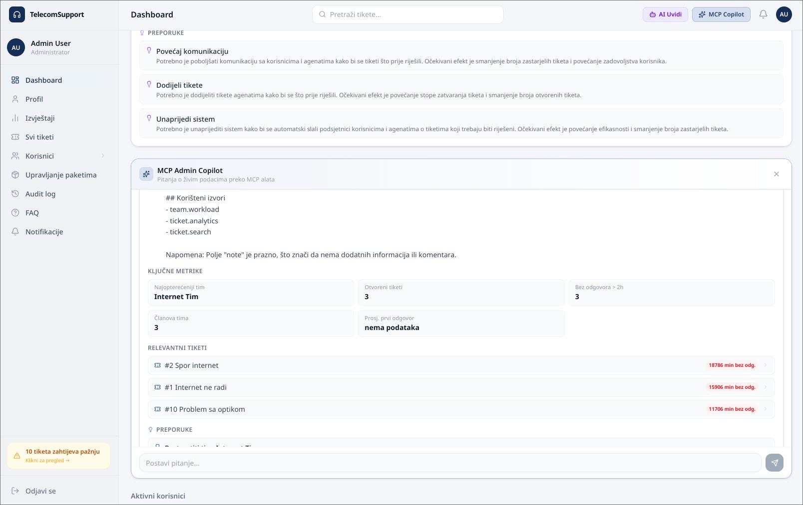

---

# 20. Administracija korisnika

Dostupno administratorima.

## Pregled korisnika

Otvoriti sekciju Korisnici. Prikazuje se lista svih korisnika u sistemu sa mogućnošću pretraživanja i filtriranja po ulozi i statusu.

## Kreiranje korisnika

## Korak 1

Kliknuti na "Novi korisnik".

## Korak 2

Popuniti: ime i prezime, email, broj telefona, ulogu (Klijent, Agent, Tehničar, Administrator).

## Korak 3

Kliknuti "Sačuvaj".

### Očekivani rezultat

Korisnik je kreiran i može se odmah prijaviti u sistem.

## Uređivanje korisnika

Kliknuti na korisnika u listi, izmijeniti podatke i sačuvati.

## Deaktivacija i reaktivacija

Kliknuti na korisnika, zatim "Deaktiviraj" ili "Reaktiviraj". Deaktivirani korisnik se ne može prijaviti u sistem.

**Napomena:** Administrator ne može deaktivirati vlastiti nalog.

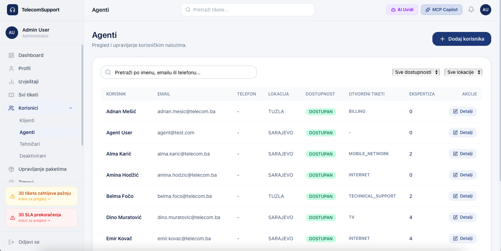

---

# 21. Administracija timova

Dostupno administratorima.

## Pregled timova

Otvoriti sekciju Timovi. Prikazuje se lista svih timova i njihovi članovi.

## Kreiranje tima

## Korak 1

Kliknuti na "Novi tim".

## Korak 2

Unijeti naziv tima i odabrati kategoriju tiketa kojom se tim bavi.

## Korak 3

Dodati članove tima iz liste dostupnih agenata i tehničara.

## Korak 4

Kliknuti "Sačuvaj".

### Očekivani rezultat

Tim je kreiran i dostupan za dodjelu tiketa.

## Izmjena članova

Kliknuti na tim, dodati ili ukloniti članove i sačuvati izmjene.

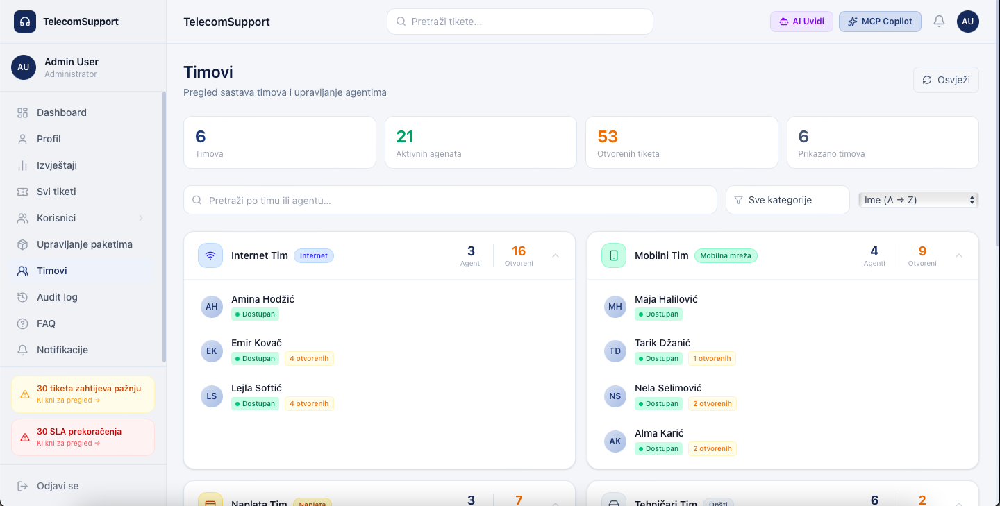

---

# 22. Izvještaji

Dostupno administratorima.

## Korak 1

Otvoriti sekciju Izvještaji.

## Korak 2

Odabrati tip izvještaja:

- Broj tiketa
- Status tiketa
- Opterećenje timova
- Ocjene korisnika

## Korak 3

Odabrati vremenski period (npr. tekuća sedmica, tekući mjesec ili prilagođeni raspon datuma).

## Korak 4

Kliknuti "Generiši".

### Očekivani rezultat

Izvještaj se prikazuje na ekranu sa grafičkim i tabelarnim prikazom podataka.

## Export

Kliknuti na "Export" za preuzimanje izvještaja kao CSV datoteke.

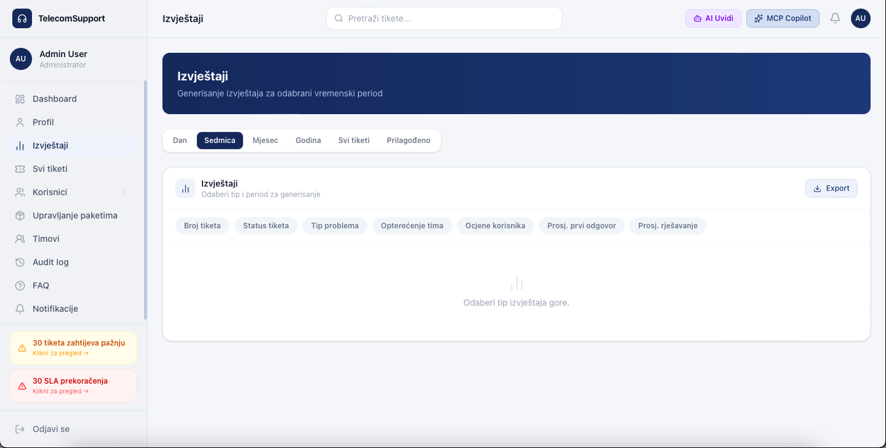

---

# 23. Audit log

Dostupno administratorima.

Audit log bilježi sve važne akcije izvršene u sistemu (kreiranje, izmjena i brisanje korisnika, timova, tiketa, FAQ unosa i dr.) zajedno sa informacijom o korisniku koji je izvršio akciju i vremenom akcije.

## Korak 1

Otvoriti sekciju Audit log.

## Korak 2

Prikazuje se hronološka lista svih zabilježenih akcija.

## Filtriranje

Listu je moguće filtrirati po:

- Tipu akcije (npr. kreiranje korisnika, zatvaranje tiketa)
- Korisniku koji je izvršio akciju

## Korak 3

Kliknuti na unos za pregled detalja konkretne akcije.

### Očekivani rezultat

Administrator dobija kompletan uvid u historiju aktivnosti sistema za potrebe nadzora i revizije.

---

# 24. Ograničenja sistema

Sistem automatski primjenjuje ovlaštenja definisana za svaku ulogu. Pokušaj pristupa funkciji bez odgovarajućih ovlaštenja rezultuje greškom pristupa.

Detaljna lista ovlaštenja i ograničenja po ulogama nalazi se u sekciji 3 ovog priručnika.

---

# 25. Preporuke za korištenje

- Koristiti FAQ prije kreiranja tiketa.
- Prilikom prijave problema dati što detaljniji opis.
- Redovno pratiti status otvorenih tiketa.
- Ne dijeliti pristupne podatke drugim korisnicima.
- Koristiti AI prijedloge kao pomoć, a ne kao konačan odgovor bez provjere.

---

# 26. Zaključak

Helpdesk i Ticketing Sistem predstavlja centralizovano rješenje za upravljanje korisničkom podrškom. Sistem omogućava efikasno upravljanje tiketima, korisnicima, timovima, paketima i izvještajima, uz dodatnu podršku AI funkcionalnosti koje unapređuju svakodnevni rad korisnika i administratora.
